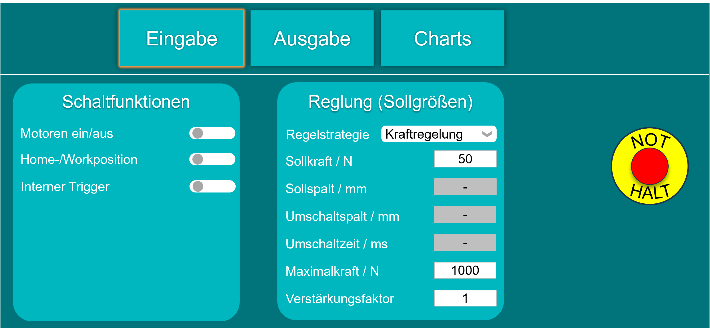
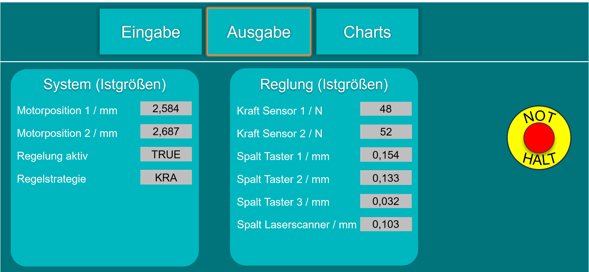
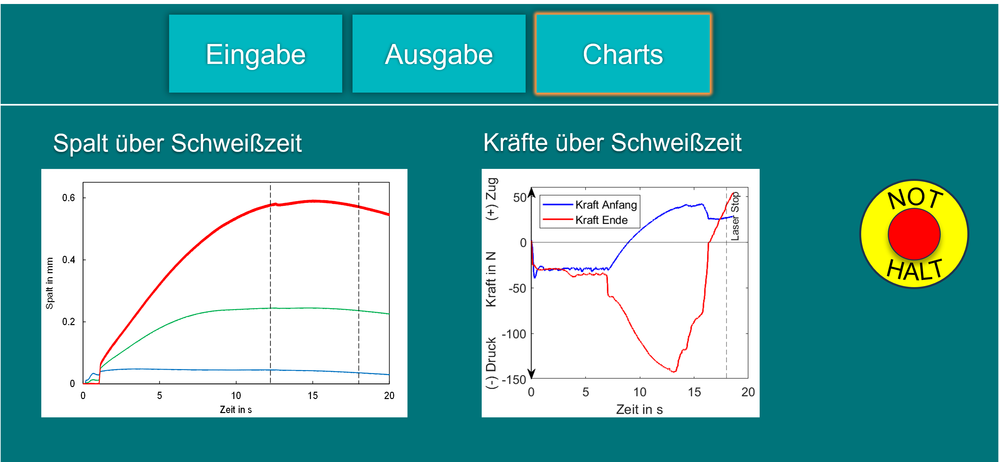

GUI TwinCAT Django

Eine webbasierte Benutzeroberfläche, entwickelt mit Django, zur Visualisierung und Steuerung von Maschinendaten aus TwinCAT-Systemen.  
Die GUI ermöglicht eine Echtzeit-Darstellung von Eingaben, Ausgaben und Prozessverläufen sowie die Konfiguration von Regelparametern und Motorsteuerungen.

🚀 Funktionen

🏠 Home-Reiter
- Übersicht über alle Hauptfunktionen  
- Schnelle Navigation zwischen Eingabe, Ausgabe und Charts  

 
⚙️ Eingabe-Reiter

  

- Einstellung der Regelparameter (Sollgrößen):

  - Kraftregelung
  - Sollkraft (`N`)
  - Sollspalt (`mm`)
  - Umschaltspalt (`mm`)
  - Umschaltzeit (`ms`)
  - Maximalkraft (`N`)
  - Verstärkungsfaktor
- Steuerung der Motoren:
  - Motoren Ein/Aus
  - Bewegung zur Home- oder Work-Position
  - Aktivierung interner Trigger

 

  

📤 Ausgabe-Reiter
- Anzeige der Systemwerte (Istgrößen) aus Sensoren:
  - Kraftsensor 1 & 2 (`N`)
  - Spaltsensoren (Taster 1–3, Laserscanner)
  - Motorpositionen (`mm`)
  - Regelung aktiv / inaktiv
  - Aktive Regelstrategie

 

  

📊 Charts-Reiter
- Echtzeit-Visualisierung der Prozessverläufe:
  - Spalt über Schweißzeit  
  - Kräfte über Schweißzeit

🧠 Systemübersicht

Die Django-basierte Web-GUI kommuniziert mit TwinCAT (über ADS oder eigene Schnittstellen), um:
- Steuerparameter und Kommandos an das System zu senden,  
- Echtzeit-Messwerte zu empfangen,  
- und diese grafisch darzustellen.  

Ideal zur Prozesssteuerung, Maschinenüberwachung und Datenauswertung.

🧩 Technologie-Stack

Komponente Technologie 

Frontend HTML, CSS, JavaScript, Bootstrap 
Backend Django (Python) 
Maschinen-Interface Beckhoff TwinCAT (ADS-Kommunikation) 
Visualisierung Chart.js / Plotly 
Datenbank SQLite / PostgreSQL (konfigurierbar) 

🧰 Installation

bash
Repository klonen
git clone https://github.com/seif98888/gui_twincat_django.git
cd gui_twincat_django

Virtuelle Umgebung erstellen
python -m venv venv
source venv/bin/activate   Windows: venv\Scripts\activate

Abhängigkeiten installieren
pip install -r requirements.txt

Django-Server starten
python manage.py runserver
